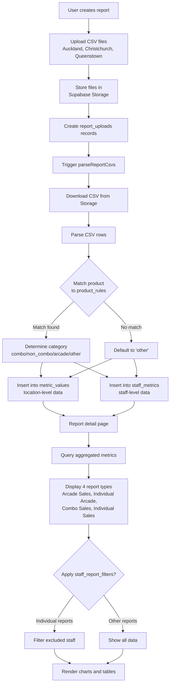

# GO Reports Architecture

## Overview

GO Reports is a Next.js web application that processes and visualizes sales data from Game Over arcade venues. The app allows users to upload CSV files containing weekly or monthly sales data from three locations (Auckland, Christchurch, and Queenstown), automatically parses and categorizes the data using configurable product rules, and generates four types of analytical reports.

The application uses Supabase as its backend, providing PostgreSQL database storage, file storage for CSV uploads, and server-side data processing. The frontend is built with React, Next.js App Router, and Tailwind CSS, providing a responsive interface for viewing reports and managing settings.

## Data Flow

The application follows a straightforward data pipeline:

1. **Upload**: Users create a report (weekly or monthly) and upload CSV files for each venue via a web form
2. **Store**: CSV files are stored in Supabase Storage, and metadata is recorded in the `reports` and `report_uploads` tables
3. **Parse**: A server-side parsing function (`parseReportCsvs`) processes each CSV, categorizing products using `product_rules`, and populates `metric_values` (location-level) and `staff_metrics` (staff-level) tables
4. **Report**: The parsed data is aggregated and displayed in four report types, with optional filtering via `staff_report_filters` for individual reports

## Report Types

### 1. Arcade Sales
Shows arcade product sales aggregated by venue. Products are grouped by their `arcade_group_label` (e.g., "$10 Card", "Spend $30") and displayed as a bar chart comparing sales across Auckland, Christchurch, and Queenstown. Data source: `metric_values` where `category = 'arcade'`.

### 2. Individual Arcade
Lists individual staff members ranked by their total arcade card sales. Shows the total number of cards sold per staff member, optionally filtered by location. Data source: `staff_metrics` where `category = 'arcade'`, with optional filtering via `staff_report_filters`.

### 3. Combo Sales
Displays combo vs non-combo sales performance by venue. Shows the total combo and non-combo quantities, calculates combo percentage, and ranks venues by performance. Data source: `metric_values` where `category IN ('combo', 'non_combo')`.

### 4. Individual Sales
Shows individual staff performance metrics for combo sales. Displays combo rate (combo sales / total sales), total combo sales, and total sales per staff member per location. Data source: `staff_metrics` where `category IN ('combo', 'non_combo')`, with optional filtering via `staff_report_filters`.

## Weekly vs Monthly Reports

Weekly and monthly reports share the same data structure and processing pipeline. The only distinction is:

- **Type field**: Reports have a `type` column set to either `'weekly'` or `'monthly'`
- **Period**: Weekly reports use a `period_start` date representing the week start (Monday), while monthly reports use the first day of the month
- **Label format**: Weekly reports are labeled as "w/c [date]" (week commencing), while monthly reports use the month name (e.g., "November 2025")
- **UI separation**: The application maintains separate pages (`/weekly-reports` and `/monthly-reports`) that filter reports by type

The CSV parsing logic is identical for both types—it processes whatever date range is present in the uploaded CSV files. Product rules, categorization, and all reporting logic work the same regardless of report type.

## Key Supabase Tables

### `reports`
Stores report metadata. Columns include:
- `id` (UUID, primary key)
- `type` ('weekly' or 'monthly')
- `period_start` (date)
- `period_end` (date)
- `label` (display name, e.g., "w/c 24 November 2025")
- `created_at` (timestamp)
- `created_by` (string)

### `report_uploads`
Links uploaded CSV files to reports. Columns include:
- `id` (UUID, primary key)
- `report_id` (foreign key to `reports`)
- `location_id` (foreign key to `locations`)
- `storage_path` (path in Supabase Storage)
- `original_name` (original filename)

### `metric_values`
Location-level product metrics. Columns include:
- `id` (UUID, primary key)
- `report_id` (foreign key to `reports`)
- `location_id` (foreign key to `locations`)
- `product_name` (string)
- `category` ('combo', 'non_combo', 'arcade', 'other')
- `arcade_group_label` (string, nullable - groups arcade products)
- `value` (numeric - quantity sold)

### `staff_metrics`
Staff-level product metrics. Columns include:
- `id` (UUID, primary key)
- `report_id` (foreign key to `reports`)
- `location_id` (foreign key to `locations`)
- `staff_name` (string)
- `product_name` (string)
- `category` ('combo', 'non_combo', 'arcade', 'other')
- `value` (numeric - quantity sold)

### `product_rules`
Configuration for categorizing products. Columns include:
- `id` (UUID, primary key)
- `location_id` (foreign key to `locations`)
- `product_pattern` (string - pattern to match product names)
- `category` ('combo', 'non_combo', 'arcade', 'other')
- `match_type` ('exact' or 'contains')
- `arcade_group_label` (string, nullable)
- `is_active` (boolean)

### `locations`
Venue information. Columns include:
- `id` (UUID, primary key)
- `name` (string, e.g., "Auckland")
- `code` (string, e.g., "AKL")

### `staff_report_filters`
User visibility preferences for individual reports. Columns include:
- `id` (UUID, primary key)
- `staff_name` (string, unique)
- `include_in_individual_reports` (boolean, default true)
- `created_at`, `updated_at` (timestamps)

## Data Flow Diagram

