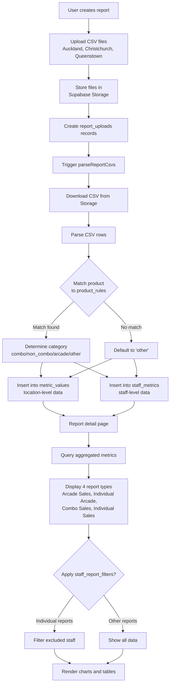

# GO Reports Architecture

## Overview

GO Reports is a Next.js web application that processes and visualizes sales data from Game Over arcade venues. The app allows users to upload CSV files containing weekly or monthly sales data from three locations (Auckland, Christchurch, and Queenstown), automatically parses and categorizes the data using configurable product rules, and generates four types of analytical reports.

The application uses Supabase as its backend, providing PostgreSQL database storage, file storage for CSV uploads, and server-side data processing. The frontend is built with React, Next.js App Router, and Tailwind CSS, providing a responsive interface for viewing reports and managing settings.

## Data Flow

The application follows a straightforward data pipeline:

1. **Upload**: Users create a report (weekly or monthly) and upload CSV files for each venue via a web form
2. **Store**: CSV files are stored in Supabase Storage, and metadata is recorded in the `reports` and `report_uploads` tables
3. **Parse**: A server-side parsing function (`parseReportCsvs`) processes each CSV, categorizing products using `product_rules`, and populates `metric_values` (location-level) and `staff_metrics` (staff-level) tables
4. **Report**: The parsed data is aggregated and displayed in four report types, with optional filtering via `staff_report_filters` for individual reports

## Core Processes

### Weekly Reports
The weekly report workflow allows users to create reports for a specific week. Users select a "week starting" date (typically a Monday), and the system automatically calculates the week end date (6 days later). The report is labeled as "w/c [date]" (week commencing) and stored with `type = 'weekly'`. Users can then upload CSV files for each venue, which are parsed and aggregated into the four report types. Weekly reports are listed on `/weekly-reports` and filtered by `type = 'weekly'` in the database.

### Monthly Reports
Monthly reports follow the same workflow as weekly reports but are designed for monthly data aggregation. Users select a month, and the system creates a report with `type = 'monthly'` and a label like "November 2025". The CSV parsing and reporting logic is identical to weekly reports—the only difference is the time period and how reports are filtered in the UI. Monthly reports are listed on `/monthly-reports` and filtered by `type = 'monthly'` in the database.

### CSV Upload & Storage
When creating a report, users upload CSV files for each of the three venues (Auckland, Christchurch, Queenstown). The files are uploaded to Supabase Storage in the `report-csvs` bucket, with paths structured as `{reportId}/{locationCode}-{timestamp}.csv`. Metadata about each upload is stored in the `report_uploads` table, linking the file to the report and location. Files are stored permanently and can be viewed/downloaded later via the "View Uploads" feature on report detail pages.

### CSV Parsing & Categorisation
The `parseReportCsvs` function processes uploaded CSV files server-side. It downloads each CSV from Supabase Storage, parses the rows using PapaParse, and identifies product rows, staff header rows, and section boundaries. For each product row, it matches the product name against `product_rules` (using exact or contains matching) to determine the category (combo, non_combo, arcade, or other). Products are then inserted into both `metric_values` (location-level aggregates) and `staff_metrics` (staff-level data). The parser handles complex CSV structures with staff sections, product headers, and "Volume In-Store" quantity columns.

### Staff Metrics (Individual Arcade & Individual Sales)
Staff metrics are calculated from the `staff_metrics` table, which stores individual staff member sales data per product per location. For **Individual Arcade**, the system aggregates `staff_metrics` where `category = 'arcade'`, summing the total cards sold per staff member. For **Individual Sales**, it aggregates `staff_metrics` where `category IN ('combo', 'non_combo')`, calculating combo rates (combo sales / total sales) per staff member. Both reports respect the `staff_report_filters` table—staff members with `include_in_individual_reports = false` are excluded from these views but their data still counts in venue-level aggregates.

### Product Rules (Settings)
Product rules are configurable patterns stored in the `product_rules` table that determine how products are categorized during CSV parsing. Each rule specifies a `product_pattern` (text to match), `match_type` (exact or contains), `category` (combo, non_combo, arcade, other), and optionally an `arcade_group_label` for grouping arcade products. Rules can be venue-specific (via `location_id`) and can be activated/deactivated. When parsing CSVs, the system matches product names against active rules to automatically categorize new products. Rules are managed via Settings → Product Rules, where users can add, edit, and filter rules by venue.

### User Filters (Settings → Users)
The user filter system allows administrators to control which staff members appear in Individual Arcade and Individual Sales reports. The `staff_report_filters` table stores per-staff visibility preferences. When a staff member is unchecked (`include_in_individual_reports = false`), they are excluded from the two individual reports but their sales data continues to be counted in all venue-level metrics and totals. This is a UI-only filter—the underlying `staff_metrics` data remains unchanged. Filters are managed via Settings → Users, which lists all staff names from `staff_metrics` with checkboxes to toggle visibility.

### Mini Reports UI (4 tabs on Weekly/Monthly report page)
Each report detail page (`/weekly-reports/[id]` or `/monthly-reports/[id]`) displays four tabs of analytical data:

1. **Arcade Sales Tab**: Bar chart showing arcade product sales by venue, grouped by `arcade_group_label`
2. **Individual Arcade Tab**: Ranked list of staff members by total arcade card sales
3. **Combo Sales Tab**: Cards showing combo vs non-combo performance per venue, with combo percentages and rankings
4. **Individual Sales Tab**: Performance pills showing each staff member's combo rate, combo sales, and total sales

All tabs fetch data from the same underlying `metric_values` and `staff_metrics` tables, but aggregate and present it differently. The UI uses React components with Recharts for visualizations and responsive Tailwind CSS for mobile-friendly layouts.

## Weekly Report Data Flow

The following diagram illustrates the complete data flow for weekly reports, from user creation through CSV parsing to final report display:

```mermaid
flowchart TD
  U[User] --> WF[Weekly Reports - Create form]

  WF --> R[reports row<br/>type = 'weekly'<br/>period_start, period_end]

  WF --> RU[report_uploads rows<br/>(one per location)]

  RU --> ST[Supabase Storage<br/>(weekly CSV files)]

  R --> PRC[parseReportCsvs(report_id)]

  ST --> PRC

  PRC --> PR[product_rules<br/>matched by location + product_name]

  PRC --> MV[metric_values<br/>(report_id, location_id,<br/>product_name, category, arcade_group_label,<br/>user_name, value)]

  PRC --> SM[staff_metrics<br/>(report_id, location_id,<br/>staff_name, category, value)]

  PRC --> UP[unmatched_products<br/>(rows that don't match any product_rule)]

  MV --> WA[Weekly report UI - Arcade Sales]

  SM --> WIA[Weekly report UI - Individual Arcade]

  MV --> WC[Weekly report UI - Combo Sales]

  MV --> WIS[Weekly report UI - Individual Sales<br/>(uses combo + non_combo, filtered by staff_report_filters)]

  SM --> WIS
```

This flow shows how:
1. Users create a weekly report via the form, which creates a `reports` row and `report_uploads` rows
2. CSV files are stored in Supabase Storage
3. The `parseReportCsvs` function reads from storage and matches products against `product_rules`
4. Parsed data is stored in `metric_values` (location-level) and `staff_metrics` (staff-level)
5. Unmatched products are tracked separately for review
6. The four report UI tabs query and aggregate this data for display

## Report Types

### 1. Arcade Sales
Shows arcade product sales aggregated by venue. Products are grouped by their `arcade_group_label` (e.g., "$10 Card", "Spend $30") and displayed as a bar chart comparing sales across Auckland, Christchurch, and Queenstown. Data source: `metric_values` where `category = 'arcade'`.

### 2. Individual Arcade
Lists individual staff members ranked by their total arcade card sales. Shows the total number of cards sold per staff member, optionally filtered by location. Data source: `staff_metrics` where `category = 'arcade'`, with optional filtering via `staff_report_filters`.

### 3. Combo Sales
Displays combo vs non-combo sales performance by venue. Shows the total combo and non-combo quantities, calculates combo percentage, and ranks venues by performance. Data source: `metric_values` where `category IN ('combo', 'non_combo')`.

### 4. Individual Sales
Shows individual staff performance metrics for combo sales. Displays combo rate (combo sales / total sales), total combo sales, and total sales per staff member per location. Data source: `staff_metrics` where `category IN ('combo', 'non_combo')`, with optional filtering via `staff_report_filters`.

## Weekly vs Monthly Reports

Weekly and monthly reports share the same data structure and processing pipeline. The only distinction is:

- **Type field**: Reports have a `type` column set to either `'weekly'` or `'monthly'`
- **Period**: Weekly reports use a `period_start` date representing the week start (Monday), while monthly reports use the first day of the month
- **Label format**: Weekly reports are labeled as "w/c [date]" (week commencing), while monthly reports use the month name (e.g., "November 2025")
- **UI separation**: The application maintains separate pages (`/weekly-reports` and `/monthly-reports`) that filter reports by type

The CSV parsing logic is identical for both types—it processes whatever date range is present in the uploaded CSV files. Product rules, categorization, and all reporting logic work the same regardless of report type.

## Key Supabase Tables

### `reports`
Stores report metadata. Columns include:
- `id` (UUID, primary key)
- `type` ('weekly' or 'monthly')
- `period_start` (date)
- `period_end` (date)
- `label` (display name, e.g., "w/c 24 November 2025")
- `created_at` (timestamp)
- `created_by` (string)

### `report_uploads`
Links uploaded CSV files to reports. Columns include:
- `id` (UUID, primary key)
- `report_id` (foreign key to `reports`)
- `location_id` (foreign key to `locations`)
- `storage_path` (path in Supabase Storage)
- `original_name` (original filename)

### `metric_values`
Location-level product metrics. Columns include:
- `id` (UUID, primary key)
- `report_id` (foreign key to `reports`)
- `location_id` (foreign key to `locations`)
- `product_name` (string)
- `category` ('combo', 'non_combo', 'arcade', 'other')
- `arcade_group_label` (string, nullable - groups arcade products)
- `value` (numeric - quantity sold)

### `staff_metrics`
Staff-level product metrics. Columns include:
- `id` (UUID, primary key)
- `report_id` (foreign key to `reports`)
- `location_id` (foreign key to `locations`)
- `staff_name` (string)
- `product_name` (string)
- `category` ('combo', 'non_combo', 'arcade', 'other')
- `value` (numeric - quantity sold)

### `product_rules`
Configuration for categorizing products. Columns include:
- `id` (UUID, primary key)
- `location_id` (foreign key to `locations`)
- `product_pattern` (string - pattern to match product names)
- `category` ('combo', 'non_combo', 'arcade', 'other')
- `match_type` ('exact' or 'contains')
- `arcade_group_label` (string, nullable)
- `is_active` (boolean)

### `locations`
Venue information. Columns include:
- `id` (UUID, primary key)
- `name` (string, e.g., "Auckland")
- `code` (string, e.g., "AKL")

### `staff_report_filters`
User visibility preferences for individual reports. Columns include:
- `id` (UUID, primary key)
- `staff_name` (string, unique)
- `include_in_individual_reports` (boolean, default true)
- `created_at`, `updated_at` (timestamps)

## Data Flow Diagram



